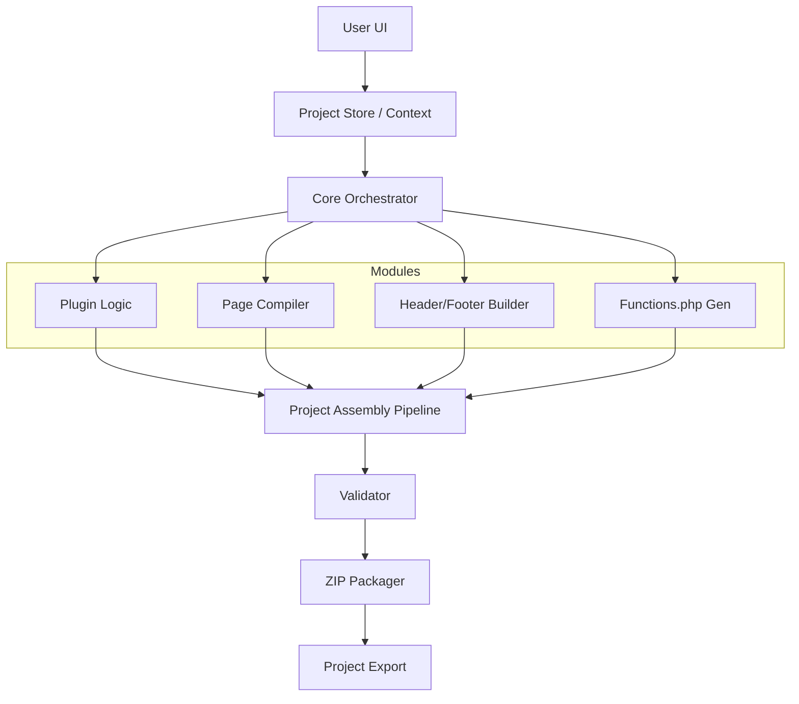

# WordPress Project Builder Platform: Architecture Blueprint

## 1. High-Level Architecture

The platform is designed as a **Modular Project Orchestrator**. It doesn't just convert strings; it manages a persistent **Project State** that evolves from a simple name to a fully packaged WordPress Theme.

### System Overview
- **Core Engine (The Orchestrator)**: Orchestrates modules and maintains the global `ProjectState`.
- **Module Layer**: Independent units (Plugin Selector, Header Builder, functions.php Generator) that contribute files or logic snippets to the project.
- **Assembly Pipeline**: Collects all module outputs, validates them, and packages them into the final structure.



### Backend Logic & Module Communication
- **State Persistence**: Projects are stored in a `projects/` directory (or database) on the server. Each action (e.g., adding a page) updates a `project.json` file in that project's directory.
- **Module Interface**: Each module must implement a `generate(state)` method that returns:
    - `files`: Array of file paths and contents.
    - `acf_groups`: Field definitions to be merged into the master ACF export.
    - `dependencies`: List of required plugins or theme supports.

---

## 2. Phase-by-Phase Roadmap

### Phase 1 — Plugin & Global State Module
- **Goal**: Implement the "Project Workspace" initialization and basic plugin selection logic.
- **Deliverables**:
    - Project creation workflow (UI + Backend storage).
    - Curated plugin list UI with toggles.
    - Logic to map selected plugins to `functions.php` snippets or required `.zip` files if bundling.

### Phase 2 — Modernized Page Builder & Page Manager
- **Goal**: Transition from a single-page tool to a multi-page manager.
- **Deliverables**:
    - "Add Page" feature (Home, About, Contact, custom).
    - Page list view (Edit, Delete, Duplicate).
    - Batch processing for HTML -> PHP conversion.

### Phase 3 — Theme Frame (Header/Footer/Functions)
- **Goal**: Automate the "Shell" of the WordPress theme.
- **Deliverables**:
    - **Header/Footer Logic**: Automated extraction of top/bottom sections from pages or a dedicated "Shell Builder".
    - **functions.php Generator**: Dynamic enqueuing based on the CSS/JS found in pages. Automatic registration of menus and sidebars.

### Phase 4 — Project Packager
- **Goal**: The "Finalizer" that assembles the theme.
- **Deliverables**:
    - Orchestrator that combines pages, header, footer, functions, and style.css.
    - Resource management (moving images/assets to a `dist/` or `assets/` folder).

### Phase 5 — Validation, Export & Deployment Docs
- **Goal**: Ensuring quality and providing a smooth handoff.
- **Deliverables**:
    - Structural validator (checks for `index.php`, `style.css`, etc.)
    - ZIP Export utility.
    - Dynamic deployment markdown generator based on the project type.

---

## 3. Ideal WordPress Theme Folder Structure (Generated)

Each project export follows the modern, clean WordPress theme standard:

```text
/press-stack-theme/
├── assets/           # Compiled JS, CSS, and optimized Images
├── inc/              # Modular PHP includes (ACF setups, helper functions)
│   ├── acf-fields.php
│   ├── theme-support.php
│   └── plugins.php    # Plugin-specific logic (SMTP, SEO configs)
├── templates/        # Page templates generated from Page Builder
│   ├── template-landing.php
│   └── template-about.php
├── header.php        # Global header logic
├── footer.php        # Global footer logic
├── functions.php     # Main entry point (enqueues + includes)
├── index.php         # Fallback template
├── style.css         # Theme metadata + base styles
└── screenshot.png    # Automatically generated preview
```

---

## 4. Module Integration into ZIP Generation

The final ZIP generation uses an **Accumulator Pattern**:

1. **Initialize Workspace**: Create a temporary build directory.
2. **Collect Page Templates**: Move all `.php` files generated from HTML to the theme root or `templates/`.
3. **Run inc/ Generators**: Call the "Functions" and "Plugin" modules to generate the files in the `inc/` folder.
4. **Merge ACF**: Combine all page-level ACF JSON/PHP exports into a single master file.
5. **Asset Injection**: Scan all generated HTML for assets (images, fonts) and move them to `assets/`.
6. **Zip & Clear**: Zip the folder and delete the temporary build directory.

---

## 5. Technical Risks & Mitigations

| Risk | Impact | Mitigation |
| :--- | :--- | :--- |
| **State Bloat** | High | Use a modular `project.json` where modules only store what they need. |
| **ACF Collision** | Medium | Implement the "Hard Validation" field collision check (already exists in v3.3.1). |
| **Asset Path Breaking** | Critical | Implement an **Asset Path Remapper** during conversion to rewrite `src="/img/..."` to `get_template_directory_uri()`. |
| **Plugin Conflicts** | Low | Stick to curated, well-known plugins with standard hooks. |
| **Server Resource Usage** | Medium | Handle zipping in a background job if projects become very large. |
